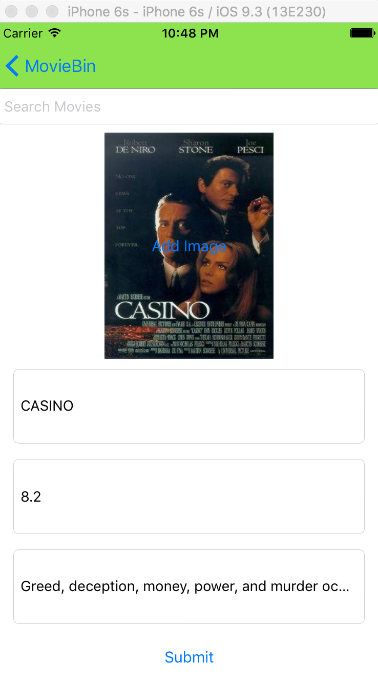

# MovieBin

This app will allow a person to store there favorite movies in a TableView. Tapping on the movie will give the user a description of the movie, the actors, an IMDB Rating, and Poster Image. On iPhone 6S Plus and iPad, a SplitView Controller will allow the user to see a side by side view.

Information is gathered in two ways.

1. Manually: Using Core Data, The information(including images) can be added by the user and stored on the device.
2. OMDB API: There is a Search Function which will pull data from the OMDB API and automatically store the data.

Swipping on any cell with in the Tableview will display the Edit and Delete functions, allowing the user to quickly Update their Collection.

The future potential of this app is to move beyond movies. Eventually adding Tv shows, games, music, or any other form of media.

